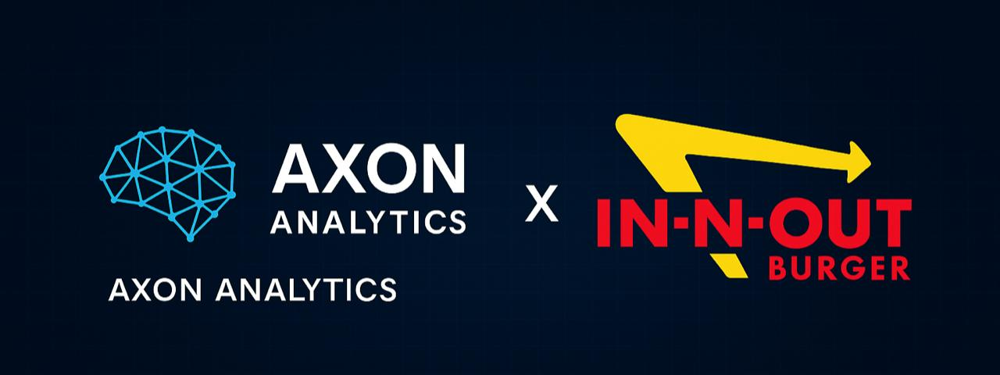
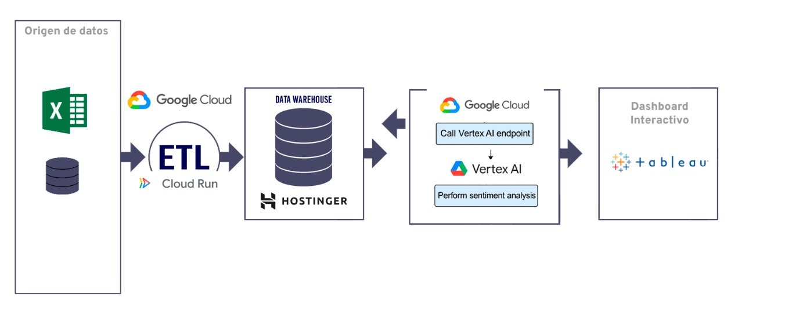

<p align="center">
  
</p>


# 📌 Análisis de Reseñas para In-N-Out | Axon Analytics

## 🧠 Contexto General

En la actualidad, las plataformas de reseñas como Google Maps y Yelp concentran millones de opiniones sobre servicios de todo tipo, en especial del sector gastronómico. Estas reseñas representan una fuente de datos de altísimo valor para las empresas, ya que reflejan de forma directa la percepción, satisfacción y preferencias del cliente.

In-N-Out, reconocida cadena de comida rápida con fuerte presencia en el estado de California, se enfrenta a nuevos desafíos en un mercado altamente competitivo: mejorar su operación actual, entender su posicionamiento frente a la competencia y encontrar zonas estratégicas para su expansión.

A través del análisis masivo y sistemático de reseñas, este proyecto busca brindar a In-N-Out una solución analítica que permita transformar los comentarios de los usuarios en información accionable para la toma de decisiones comerciales.

## 🧑‍💼 Cliente

**Empresa:** In-N-Out Burger  
**Ubicación:** Estado de California (EE.UU.)  
**Sector:** Comida rápida  
**Necesidades del negocio:**
- Diagnosticar su posicionamiento actual.
- Comparar sus sucursales entre sí y contra la competencia directa.
- Evaluar condiciones óptimas para seleccionar nuevas zonas de apertura.

## ❗ Problemáticas Detectadas

- Falta de herramientas internas para el análisis sistemático de reseñas.
- Dificultad para comparar el desempeño entre sucursales a través de métricas cuantificables.
- Ausencia de criterios objetivos para seleccionar nuevas ubicaciones potenciales.
- Desaprovechamiento del contenido textual de las reseñas, que muchas veces queda sin analizar a fondo.

## 🎯 Objetivo General

Desarrollar una solución analítica integral basada en datos públicos de Google Maps y Yelp para permitir que In-N-Out:
- Evalúe su desempeño actual,
- Identifique oportunidades de mejora en sus locales,
- Y explore zonas estratégicas para abrir nuevas sucursales dentro del estado de California.

## 🎯 Objetivos Específicos

- Recopilar, limpiar y estructurar datos de Google Maps y Yelp sobre locales gastronómicos.
- Realizar un análisis exploratorio detallado para comprender tendencias de reseñas, puntuaciones, atributos y localización.
- Implementar modelos de NLP para clasificar automáticamente las reseñas según su sentimiento.
- Medir el posicionamiento de In-N-Out frente a otras cadenas de comida rápida en base a KPIs claros.
- Construir un dashboard interactivo que permita visualizar la reputación por sucursal, la evolución de reseñas en el tiempo y las zonas con oportunidad de expansión.
- Documentar todo el proceso con claridad, desde el ETL hasta el modelo de ML y la visualización.

## 📊 KPIs Definidos

1. **Tasa de crecimiento de reseñas por localidad (KPI 1):**  
   Mide el incremento porcentual de reseñas publicadas trimestre a trimestre por ciudad o zona. Refleja visibilidad y volumen de interacción de clientes con cada sucursal.

2. **Net Promoter Score estimado (KPI 2):**  
   A partir del análisis de sentimiento, clasificamos reseñas como Promotores, Pasivos o Detractores. El resultado es proporcional a la población de la zona.

3. **Densidad de población por local gastronómico (KPI 3):**  
   Compara la cantidad de personas por restaurante en cada localidad para detectar zonas saturadas o con oportunidad.

4. **Influencia de atributos en el rating promedio (KPI 4):**  
   Analiza qué servicios ofrecidos por los locales (ej: delivery, accesibilidad, atención) están correlacionados con mejores calificaciones.

## 🧰 Stack Tecnológico

- **Python (VSCode):** pandas, numpy, matplotlib, seaborn, wordcloud, scikit-learn
- **Tableau:** visualización del dashboard final
- **Hostinger + SQL:** almacenamiento de datos
- **Google Cloud Platform (Vertex AI):** procesamiento ETL escalable
- **GitHub:** control de versiones, colaboración y documentación del proyecto

  <p align="center">
  
</p>

## 🧪 Metodología de Trabajo

- Trabajo colaborativo entre 5 integrantes del equipo Axon.
- División clara de roles: análisis de datos, modelado, visualización, documentación.
- Reuniones diarias y seguimiento de tareas con cronograma Gantt.
- Validación cruzada de entregables y ajustes iterativos.
- Priorización de objetivos realistas y delimitación clara del alcance.

## ✂️ Alcance del Proyecto

**Incluido:**
- Análisis exclusivo del estado de California.
- Solo negocios etiquetados como *fast food*.
- Clasificación de reseñas desde 2016 hasta la actualidad.
- Visualización de datos históricos, sentimiento y KPIs estratégicos.

**Excluido:**
- Análisis fuera de California.
- Predicción futura.
- Datos internos confidenciales de la cadena.

## 🗂️ Estructura del Repositorio

```
├── data/                  # Datasets originales y procesados
├── notebooks/             # Notebooks de EDA, limpieza y modelos
├── src/                   # Código fuente del recomendador
├── dashboards/            # Visualizaciones y análisis de KPIs
├── README.md              # Este archivo
```


## 🚀 Valor de la Solución para el Cliente

- Conocer el posicionamiento de cada sucursal.
- Detectar oportunidades de expansión en zonas estratégicas.
- Medir el impacto de ciertos atributos en la satisfacción del cliente.
- Tomar decisiones basadas en datos concretos y actualizados.


## 📌 Estado del Proyecto

✅ En desarrollo – Etapa de integración de modelos y dashboards.  
🚀 MVP funcional y entregables planificados para demo final.

---

## 👥 Equipo de Trabajo

- Rocío Ruiz - Project Manager/Machine Learning Engineer
- Juan Pablo Fernández - Data Analyst
- Fernando Hernández - Data Engineer
- Sergio Piratoba - Data Engineer
- Michel Torrealba - Data Analyst
